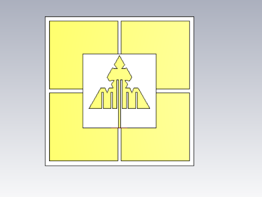
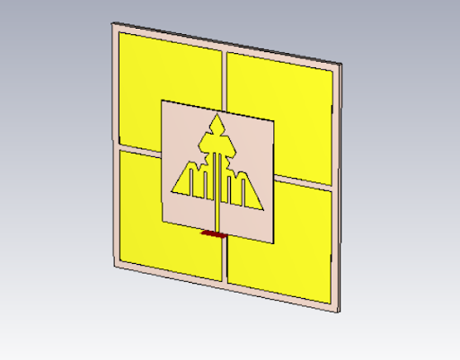
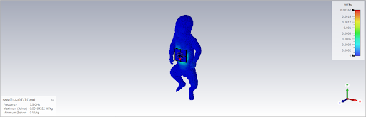
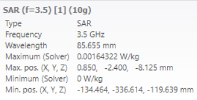

# Koch Fractal Based Wearable Antenna Backed with EBG Plane
## Introduction
 - Worldwide Interoperability for Microwave Access or WiMax for short is a standardized wireless version of Ethernet intended primarily as an alternative to wire technologies (such as Cable Modems, DSL and T1/E1 links) to provide broadband access to customer premises.
 - It is intended to provide the last mile coverage from the internet backbone(generally made using fiber optic cables) to the gateways and homes(which are conventionally provided by DSL).
 - WiMAX directly supports the technologies that make triple-play service offerings possible (such as quality of service and multicast). These are inherent to the WiMAX standard rather than being added on as carrier Ethernet is to Ethernet.
 
## Proposed Design
 A low-profile Koch modified monopole antenna backed with EBG plane has been proposed in this work for wearable applications of Wimax standards. This work is composed of a triangular-shaped microstrip antenna as a radiator and a 2 x 2 square-shaped EBG plane as a reflector to improve the isolation between the antenna and human body tissues.Meandering slits are added to reduce the size as well increase the flexibility.

##Why Triangular fractal antenna?
Our main idea presented in this work is the reduction of size of the antenna required by designing it as a fractal antenna. In this case, using cavity model of the microstrip patch antenna, we came to the conclusion that a triangular antenna would reduce greatly in size if we were to use an antenna design. (Simulations to verify the above were done and took 10 days overall)

## Design

We designed the shape of the antenna using the paper. While we optimized the parameters for WiMax application using the previously mentioned cavity model.( 1 day for design and 5 days for changing the parameters and debugging).

## Optimization and improvements

Once we were done with the design. We moved on to optimization phase. We noticed using the optimizer present in CST STUDIO that the we were able to get a large improvement in SAR values using optimization of the parameters( especially in the EBG layer). ( 10 days for optimizations)

 ## Results
 
  
  ### S11 vs Frequency
  
  ### SAR Calculation
  
   
 
 
 ## Comparison of parameters of existing parameters and our parameters
 Parameter| Description | Value(mm)
 -------------|-----------------|-----------------------
Wg | Width of the ground plane|41
Lg|Length of the ground plane|41
ht|Height of the ground plane|0.035
hs|Height of the Substrate|0.508
fg|Fractal reduction dimension|6.5 (
if|Inset feed width|1.4
menb|Distance between Monopole antenna and EBG|4.2
hebg|Width of the copper in EBG plane|0.04
d1,d2|Distance of the meandering slits from the inset feed|2.5, 4.09
